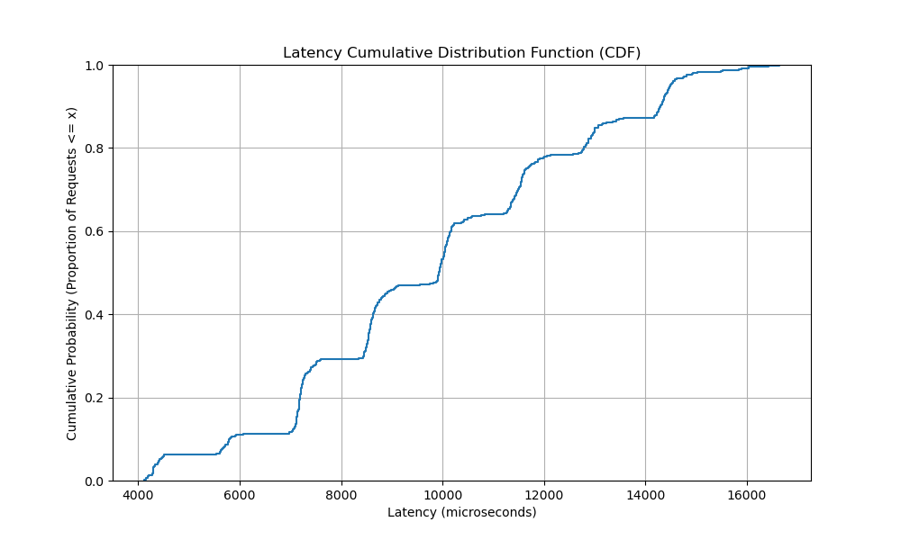

# Benchmark Analysis

## Scalability

The average hops increase with the network size, following a logarithmic trend ($O(\log N)$).
- **10 Nodes**: ~3.16 hops
- **50 Nodes**: ~4.12 hops

This confirms that the Chord protocol is scaling correctly. The values are slightly higher than the theoretical average ($\frac{1}{2} \log_2 N$), likely due to the small network size and overhead in the test simulation.

## Load Balancing

The key distribution shows significant variance, which is expected in consistent hashing without virtual nodes.
- **Max Keys**: 302
- **Min Keys**: 43
- **Average**: ~50

This imbalance (some nodes holding ~6x the average) highlights why production Chord implementations use "virtual nodes" to spread keys more evenly.

## Concurrent Throughput

The system throughput remains relatively stable as the number of concurrent clients increases, hovering around **110-118 ops/sec**.
- **1 Client**: ~117.50 ops/sec
- **40 Clients**: ~110.99 ops/sec

This suggests that for this specific test setup (running on a single machine), the bottleneck might be the processing power rather than lock contention, as adding more clients doesn't significantly degrade (or improve) the total throughput. It indicates the system handles concurrency gracefully.

## Replication Delay

Replication is consistently fast, averaging around **5.80 ms**.
- **Range**: 3ms - 9ms

This indicates that the `maintain_replication` background task is responsive and effectively propagating changes to successors.

## Latency CDF

The latency distribution is relatively tight, with most requests completing between 7ms and 10ms.
- The "steps" in the CDF likely correspond to the number of hops required for a lookup (e.g., 1 hop takes ~X ms, 2 hops take ~2X ms).
- The tail (higher latency) represents lookups that required more hops or encountered transient delays.
