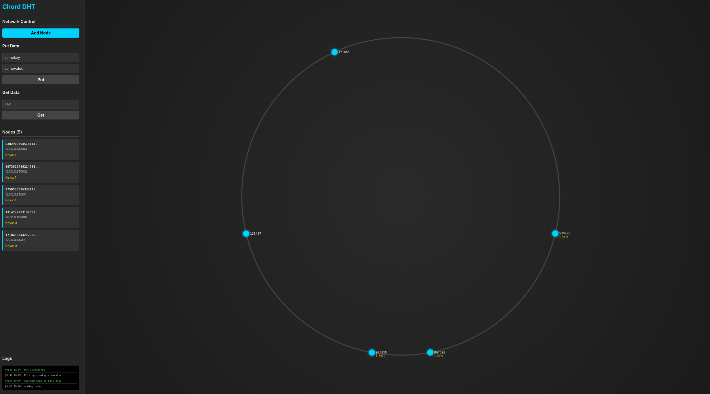
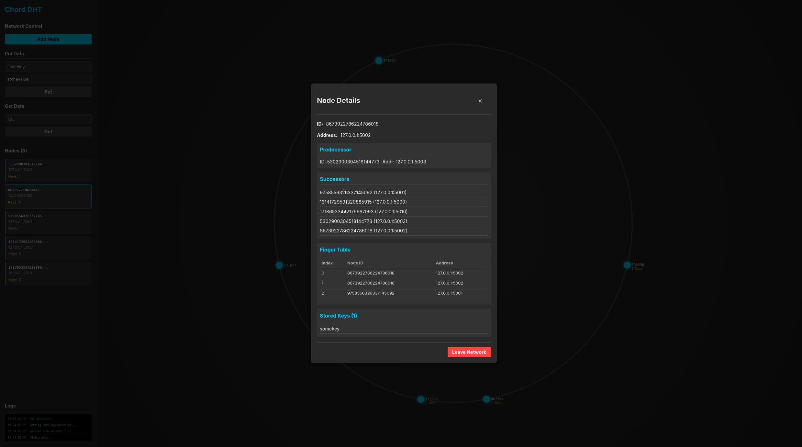
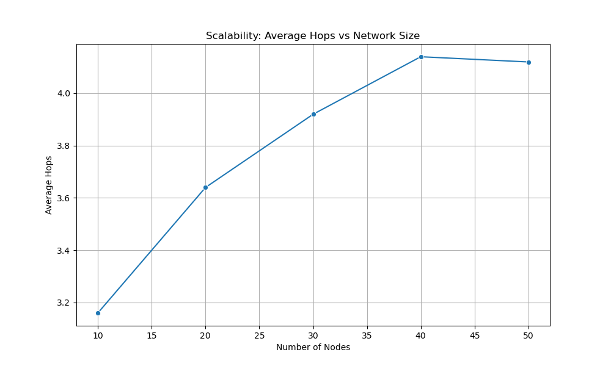
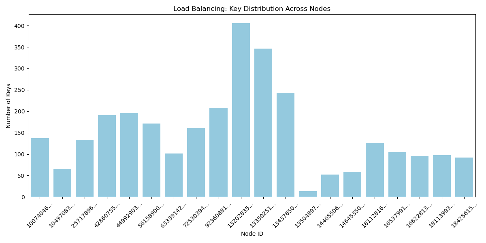
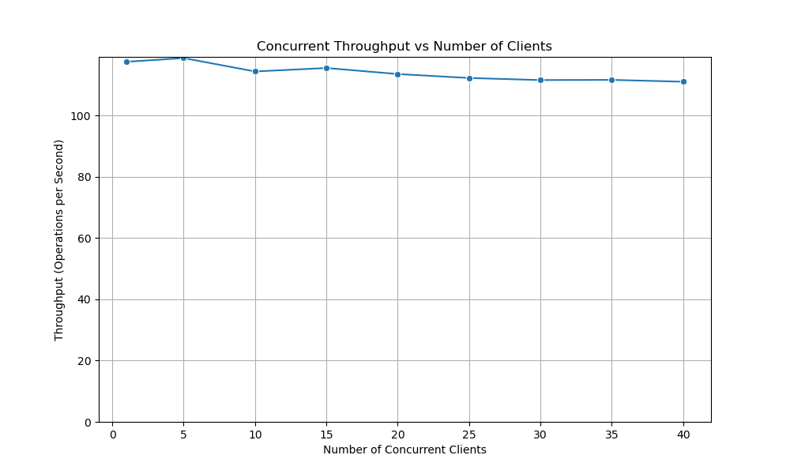
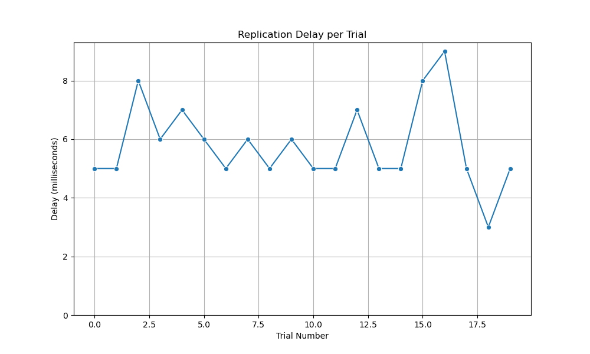

# Project 16: Chord with Replication

> Moida Praneeth Jain (2022101093), Yajat Rangnekar (2023114008)

## 1. Introduction
This report details the implementation and analysis of a Chord Distributed Hash Table (DHT) with added replication for fault tolerance. The project aims to build a scalable, decentralized peer-to-peer system capable of efficient data lookup and storage. The system follows the core principles of the Chord protocol, with logarithmic scalability and robust handling of dynamic node membership.

## 2. System Architecture
The system is built as a distributed application with three primary components: the **Chord Node**, the **Chord Client**, and a shared **Protocol** library.

### 2.1 Chord Node (`chord_node`)
The core of the system is the Chord node. Each node operates as an independent process that:
- Maintains the distributed hash table state (finger tables, successor lists, and data store).
- Handles incoming RPC requests from other nodes and clients.
- Executes background maintenance tasks to stabilize the ring and ensure data replication.
- **Tech Stack**: Rust, Tokio (Async Runtime), Tonic (gRPC), Serde (Serialization).

### 2.2 Chord Client (`chord_client`)
A command-line interface (CLI) tool that allows users to interact with the DHT. It connects to any active node in the ring to perform operations such as:
- **Put**: Storing a key-value pair in the DHT.
- **Get**: Retrieving a value associated with a key.
- **Find Successor**: Debugging the routing by querying which node is responsible for a specific ID.
The client acts as an external agent, demonstrating how applications would interface with the Chord ring.

### 2.3 Shared Protocol (`chord_proto`)
All communication is defined in a shared protocol library.
- **gRPC & Protobuf**: The service interface and message structures are defined in Protocol Buffers.
- **Code Generation**: The `tonic-build` crate automatically generates the Rust server and client code from these definitions, ensuring that `chord_node`, `chord_client`, and other tools speak the exact same language.

### 2.4 Monitoring
For visualization and debugging purposes, a **Chord Monitor** was also developed. It aggregates state from the nodes to provide a real-time view of the ring topology, which is useful for verifying the correctness of the routing and replication logic during development.

## 3. RPC Interface
The nodes communicate using a set of Remote Procedure Calls (RPCs) defined in the `Chord` service. These RPCs handle everything from ring maintenance to data storage.

### 3.1 Ring Maintenance RPCs
These RPCs are primarily used by the background stabilization tasks to maintain the ring topology.
- **`FindSuccessor(id)`**: It asks a node to find the successor of a given identifier `id`. This is used for both looking up keys and finding where a new node should join.
- **`GetSuccessor()`**: Returns the node's immediate successor. Used during stabilization to verify links.
- **`GetPredecessor()`**: Returns the node's current predecessor. Used by the stabilization task to verify the ring's integrity and discover new nodes.
- **`Notify(node)`**: A node calls this on its successor to suggest itself as the successor's new predecessor. This is the mechanism by which new nodes introduce themselves to the ring.
- **`GetSuccessorList()`**: Returns the node's list of nearest successors. This is crucial for fault tolerance; if a node's immediate successor fails, it uses this list to find the next live node.
- **`Ping()`**: A lightweight check used to verify if a node is still alive and reachable.

### 3.2 Data Operation RPCs
These RPCs handle the storage and retrieval of user data.
- **`Put(key, value)`**: Requests the node to store a key-value pair. If the node is not the owner of the key, it forwards the request to the correct node (or returns the correct node's address).
- **`Get(key)`**: Requests the value for a given key. Like `Put`, this is routed to the node responsible for the key.
- **`Replicate(key, value)`**: A specialized version of `Put` used for replication. It instructs a node to store a key-value pair as a replica, not as the primary owner. This is called by the `maintain_replication` task.
- **`TransferKeys(keys)`**: Used during node joins and leaves. It bulk-transfers a map of key-value pairs from one node to another to ensure data stays with its correct owner.

## 4. Core Protocol Implementation

### 4.1 Consistent Hashing
The system uses consistent hashing to assign keys to nodes. Both nodes and data keys are hashed into the same 160-bit identifier space using SHA-1. A key is stored on the first node whose identifier is equal to or follows the key's identifier in the identifier space (its successor). This ensures that when a node joins or leaves, only a small fraction of keys need to be moved.

### 4.2 Scalable Lookup (Finger Tables)
To avoid linear search around the ring, each node maintains a routing table called a "finger table". The $i$-th entry in this table points to the successor of the node $2^{i-1}$ positions away in the ring. This allows a node to forward a query at least halfway to the target in a single step, resulting in an $O(\log N)$ lookup complexity.

### 4.3 Background Maintenance Tasks
The correctness and performance of the Chord ring rely on several background tasks that run periodically on every node.

#### Stabilization
This task ensures that a node's immediate successor is correct. It periodically asks its current successor for *its* predecessor. If the successor reports a predecessor that is closer to the current node than the successor itself, the current node updates its successor to this new node. This process heals the ring structure as new nodes join.

#### Finger Table Refresh
To keep lookups efficient, the finger table entries must be kept up-to-date. A background task periodically picks a random index in the finger table and re-calculates the correct node for that entry by performing a lookup. Over time, this ensures all finger table entries are correct even as the network topology changes.

#### Predecessor Check
Each node periodically pings its predecessor to verify it is still alive. If the predecessor fails to respond, the node assumes it has failed and clears its predecessor pointer, allowing a new node to eventually take that spot.

## 5. Dynamic Membership

### 5.1 Node Join
When a new node joins the network, it contacts an existing "bootstrap" node. It uses this bootstrap node to look up its own successor in the ring. Once the successor is found, the new node initializes its state and notifies the successor. The stabilization process then naturally integrates the new node into the ring, updating the neighbors' pointers.

### 5.2 Key Transfer
Upon joining, a new node becomes responsible for a range of keys that were previously held by its successor. The successor identifies these keys and transfers them to the new node. This ensures that data remains accessible at the correct location in the ring.

### 5.3 Graceful Leave
When a node voluntarily leaves the network, it performs a graceful exit. It transfers all its stored keys to its successor and notifies its successor and predecessor to update their links. This prevents data loss and minimizes disruption to the ring.

## 6. Fault Tolerance
The system is designed to handle unexpected node failures without losing data or breaking the ring.

### 6.1 Successor Lists
A single successor pointer is fragile; if the successor fails, the ring is broken. To prevent this, each node maintains a list of its $r$ nearest successors. If the immediate successor fails to respond, the node can skip it and connect to the next live node in the list. This ensures the ring remains connected even if multiple adjacent nodes fail simultaneously.

### 6.2 Failure Detection
The predecessor check task actively monitors the health of the immediate neighbor. When a failure is detected, the node updates its internal state to reflect the loss, and the stabilization protocol eventually propagates this information to correct the routing tables of other nodes.

## 7. Replication
To guarantee data availability, the system implements a replication strategy distinct from the core routing protocol.

### 7.1 Successor Replication
Every data item is stored on its primary owner (the successor of the key) and is also replicated to the next $k$ successors in the ring. This ensures that even if the primary owner fails, the data can still be retrieved from one of the replicas.

### 7.2 Active Replication Maintenance
A dedicated background task runs periodically to ensure the replication factor is maintained. It iterates through the keys stored on the node and checks if the node is the primary owner of that key. If it is, the task pushes copies of the key to its current list of successors. This self-healing mechanism automatically re-replicates data when a replica node fails or when new nodes join the replication range.

## 8. Visualization
The `chord_monitor` provides a powerful interface to observe the system's behavior.

### 8.1 Real-time Ring View
The dashboard displays the live topology of the ring. Nodes are arranged in a circle, and their connections (successors/predecessors) are visualized. This makes it easy to spot partitions or incorrect routing.

*Figure 1: The main dashboard showing the active Chord ring, logs, and control panel.*

### 8.2 Node Inspection
Clicking on a node reveals its internal state, including its ID, address, finger table entries, and the specific keys it is currently storing. This level of detail is invaluable for debugging routing issues and verifying key distribution.

*Figure 2: Detailed view of a single node, showing its finger table and stored keys.*

## 9. Benchmarks and Results
We conducted a series of benchmarks to validate the performance and correctness of our implementation. These tests were run in a simulated environment on a single machine.

### 9.1 Scalability
We measured how the lookup cost scales with the network size. As shown in the graph below, the average number of hops required to find a key increases logarithmically with the number of nodes. This confirms that our implementation adheres to the theoretical $O(\log N)$ bound of the Chord protocol.

### 9.2 Load Balancing
In a consistent hashing scheme without virtual nodes, load distribution can be uneven. Our benchmark (inserting 1000 keys into 20 nodes) confirmed this, showing a significant variance in the number of keys stored per node. While the average load was around 50 keys (without replication), some nodes held significantly more. 

With replication, some nodes showcased a higher load, leading to more variance, shifting the mean to around 150 keys per node. This is in tandem with the fact that the replication factor was 2 during our testing. 

### 9.3 Concurrent Throughput
To test the system's robustness, we measured throughput under increasing concurrency. The system maintained a stable throughput of approximately 110-118 operations per second even as we scaled from 1 to 40 concurrent clients. This stability indicates that the system handles concurrent requests gracefully, with the bottleneck likely being the local simulation environment rather than lock contention.

### 9.4 Replication Latency
We measured the time taken for a key to be fully replicated to its successors. The results show an average delay of just 5.80 ms. This low latency demonstrates the efficiency of our replication maintenance task, ensuring that data is durable almost immediately after being written.

## 10. Conclusion
This project successfully implements a robust Chord DHT with replication and a comprehensive visualization suite. The system demonstrates the expected logarithmic scalability and handles dynamic node churn with graceful data handover. The addition of the monitoring tool proved essential for understanding the complex interactions within the distributed system.

The current implementation prioritizes availability over consistency. This is to ensure that all the operations can take place almost instanteneously, without significant delay (as shown in our testing). This does lead to some minor inconsistencies, which are resolved eventually by the `stabilize_ring()` function, leading to eventual consistency. The current inconsistencies do not incorrect `GET` operations, but lead to extra replication. 

Future improvements could include implementing virtual nodes to address the load balancing variance observed in our benchmarks.
